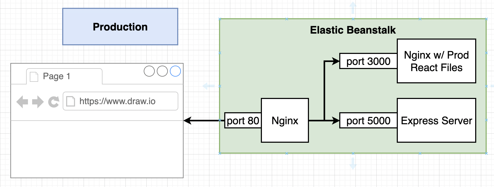

# docker-kubernetes-travis-multicontainer
Project used in the Docker / Kubernetes Udemy course, to setup a CI/CD pipeline with Travis &amp; AWS for a multi-container application.

### Fibonacci: Multi-container React App
The starting point for this project is the 
[Fibonacci React App](https://github.com/roelfie/docker-kubernetes-course/tree/main/src/docker/8_docker_fibonacci)
from the Docker / Kubernetes course.

The Fibonacci app is an application [composed of 6 containers](./docker-compose.yml).

### Container registries
In [docker-kubernetes-travis-ci-cd](https://github.com/roelfie/docker-kubernetes-travis-ci-cd) we have created a 
Travis pipeline for a single container application. That pipeline cloned the repository into AWS S3 and let 
Beanstalk do the 'docker build' (based on a 2-phase Dockerfile that first performed an 'npm run build' in a Node 
image & then copied the resulting /app/build folder into an Nginx image).

In this pipeline we will [let Travis build & upload the images to Docker Hub](./.travis.yml) so Beanstalk can 
simply download & deploy the containers from Docker Hub.

A similar approach works for any cloud provider. And instead of using Docker Hub, we could use any container registry 
(like AWS ECR or GCP Container Registry).

### Multiple Nginx

The application contains two instances of nginx: 
* One nginx in front, to route the data to 'client' or to 'api'.
* One nginx to host the 'client' React app (on a non-standard port!)

### More info
* https://docs.docker.com/engine/reference/run/#env-environment-variables
* https://create-react-app.dev/docs/running-tests/#continuous-integration

My Travis builds of this GitHub project can be found [here](TODO).

